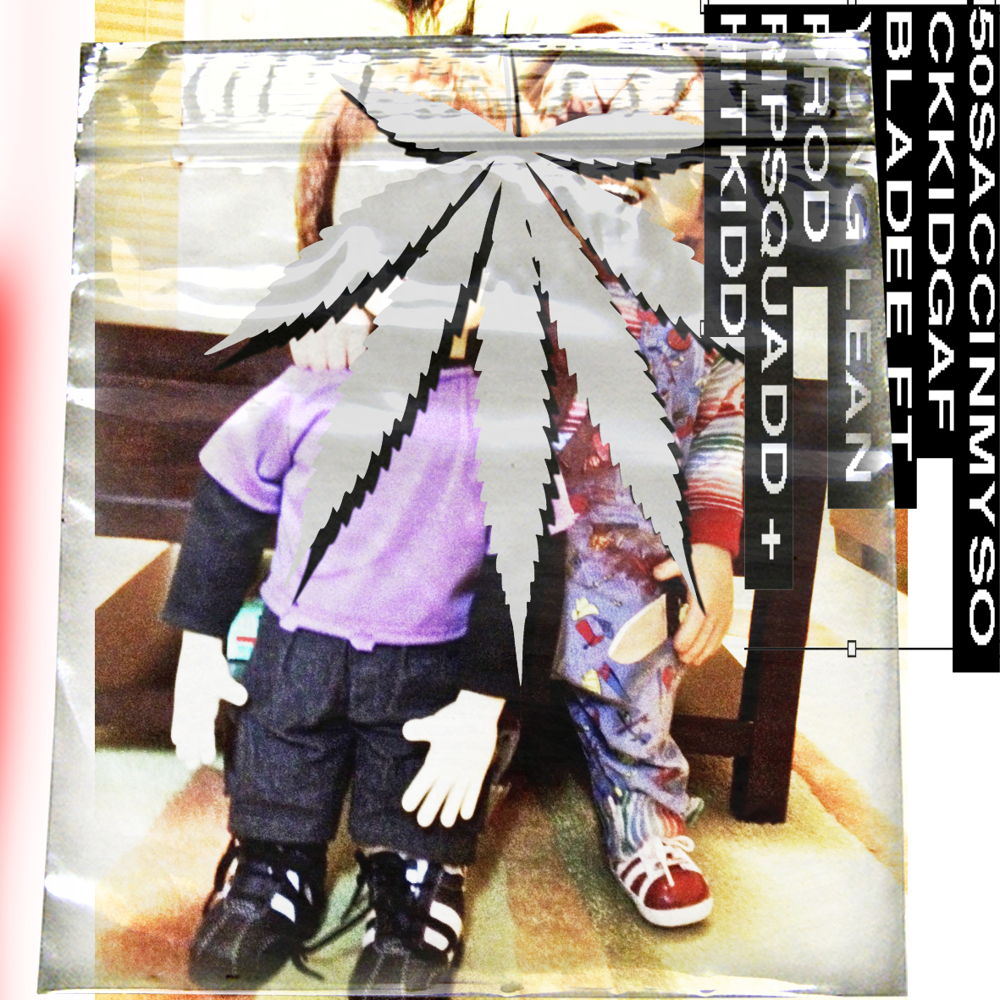

## A really stupid account for really stupid projects

### (Somewhat) Active:
* [Arch-Update-Scripts](https://github.com/Hatboxforses/Arch-Update-Scripts)
* [Catppuccin Gimp Theme](https://github.com/Hatboxforses/Catppuccin-Gimp-Theme)
* [retard-central.neocities](https://github.com/Hatboxforses/retard-central.neocities)
    * [Peggle Saves](https://github.com/Hatboxforses/Peggle-Saves)
    * [catppuccin-macchiato-monaco-theme-demo](https://github.com/Hatboxforses/catppuccin-macchiato-monaco-theme-demo)

### Archived:
* [Yeah](https://github.com/Hatboxforses/Yeah) (really stupid electron app without the source code available bc I deleted it (spoiler it was an iframe))
* [Gary.py](https://github.com/Hatboxforses/Gary.py) (An old python app I made as a text adventure)
* [Minimal-ahh-neovim-config-💀](https://github.com/Hatboxforses/Minimal-ahh-neovim-config) (Just Bad Code™)
* [Code Studio App Lab Touhou Game](https://github.com/Hatboxforses/Code-Studio-App-Lab-Touhou-Game) (A project for AP Computer Science that I dedicated way too much time to)